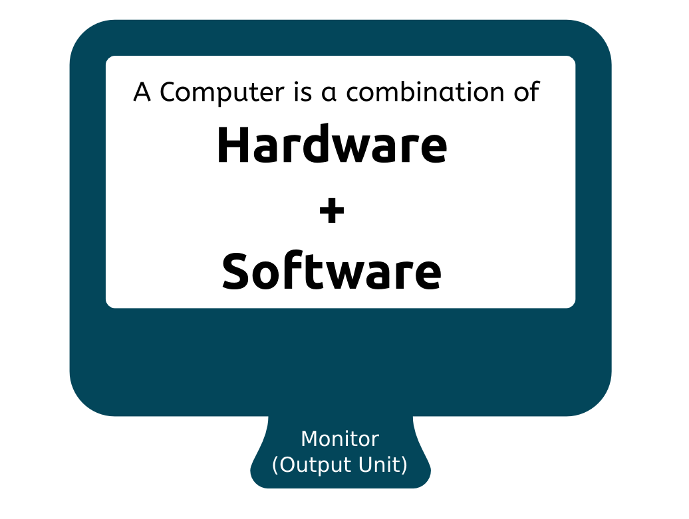

# Introduction to Computer

**Computer**, now-a-days is often defined as an **electronic machine** capable of doing mathematical calculations and other computations. The reason why it is called as **electronic machine** is that, computers work because of the **movement of electrons** (i.e flow of **current**). Modern day computers cannot function without current. I leave it to you to find why it is not called as electrical device but as electronic device.

The word `computer` itself is derieved from the word **Compute**. Anyone who computes are called as Computer. In olden days, computers were **mechanical machines**, humans were required to power and operate the computer and so those who operated the computers in olden days were called as **Computers**, similar to how we call **driver** who **drives** the vehicle. Today, the computers requires very minimal human effort and is powered by electricity, so the machine itself is called as Computer.

It has also become a general purpose device and the term **personal computer** has redefined the ways computers can be consumed in day-to-day life.

So what do most of us do with computer today?

we,

- watch videos.
- hear songs.
- play games.
- browse through internet.
- communicate with other people.

Now here comes some questions, how do we play a song or video? how do we communicate or talk with other people using computer? We use **'Application Software'** to achieve those specific purposes. For example, we use media players to play a song or video, we use web browser to browse the internet. So, for different purposes we use different softwares.

Most often the word 'System' is also used interchangeably when referring to 'Computer'. So a Computer system is not just about Software. It is the combination of **Hardware** + **Software** that makes the computer, a complete system.

Those who use computer are called as **End Users**, those who create hardware are called **Hardware Manufacturers** and those who create / develop software are called **Software Developers**.

We will see more about Hardware and Software in following chapters.

-----

