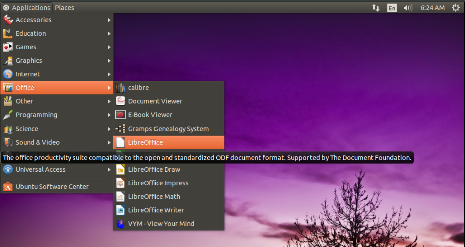
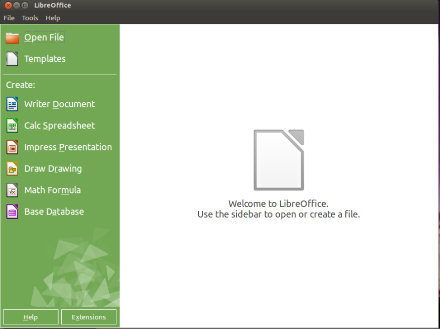

# Opening LibreOffice

This section will help you find LibreOffice from Applications Menu and open it. Please refer the below screenshots & instructions for reference.

Here is the order where you can spot LibreOffice.

* Using your mouse pointer, Single Left Click on **Applications**.
* Move the mouse pointer to **Office** and wait until another section appears.
* Move the mouse pointer to right section & Single Left click on **LibreOffice**.

** Applications > Office > LibreOffice **

The LibreOffice *Splash-Screen* will appear for few seconds and will disappear.

As soon as the Splash-screen disappears **LibreOffice Welcome Screen** will appear as shown in the below screenshot.

Awesome. You have just learnt how to find and open LibreOffice in your computer. From now on, whenever you wanted to open LibreOffice, you have to follow this procedure.

