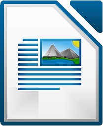
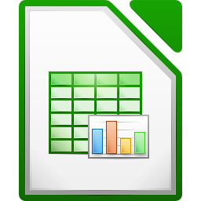
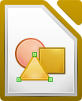
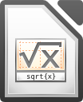

#LibreOffice

## What is Libre Office ?

LibreOffice is a comprehensive, professional-quality productivity office suite of applications for your Desktop, Servers and Services. LibreOffice is a **Free software** that you can download and install for free. There is a large base of satisfied LibreOffice users worldwide, and it is available in more than 30 languages and for all major operating systems, including Microsoft Windows, Mac OS X and GNU/Linux (Debian, Ubuntu, Fedora, Mandriva, Suse, ...).

## What's outstanding about LibreOffice?

LibreOffice is a feature packed and mature desktop productivity package with some really great
advantages:

1. It's free – no worry about license costs or annual fees.
2. No language barriers – it's available in a large number of languages, with more being added continually.
3. LGPL public license – you can use it, customize it, hack it and copy it with free user support and  developer support from our active worldwide community and our large and experienced developer team.
4. LibreOffice is a free software community - driven project: development is open to new talent and new ideas, and our software is tested and used daily by a large and devoted user community;  you, too, can get involved and influence it's future development.

---

## Components of Libre Office

### 1. Writer 

It is LibreOffice Suite for **Word Processing**. It provides us the functionality to **create and edit documents**. It is used for various operations like drafting an office letter to producing an entire book. 

> Writer is one of the Free software alternate to MS Office Word.

Some Features of LibreOffice Writer:

1. Auto-completion
2. Auto- Formatting
3. Auto Spell Checking
4. Auto Correct
5. Multi-Column articles
6. Saving in multiple formats (pdf, odt, docx, html, etc.,)

---

### 2. Calc

It is the LibreOffice Suite for **Spreadsheets**. Calc tames your numbers and helps with difficult decisions when you're weighing the alternatives. Analyze your data with Calc and then use it to present your final output. Charts and analysis tools help bring transparency to your conclusions.

> Calc is one of the Free Software alternate to MS Office Excel.

Some Features of LibreOffice Calc:

1. Ability to read/write OpenDocument (ODF), Excel (XLS), CSV and several other formats.
2. Support for a large number of functions, including those for imaginary numbers, as well as financial and statistical functions.
3. Supports 1 million rows in a spreadsheet, making LibreOffice spreadsheets more suitable for heavier scientific or financial spreadsheets. However, the number of columns is restricted to at most 1024, much lower than Excel's limit of 16384.

---

### 3. Impress

LibreOffice Impress lets you create professional slide shows that can include charts, drawing objects, text, multimedia and a variety of other items. If you want, you can even import and modify Microsoft PowerPoint presentations. For on-screen slide shows, animation, slide transitions and multimedia are a few of the techniques you can use to make your presentation more exciting.

> Impress is one of the Free Software alternate to MS Office Powerpoint.

Some features of LibreOffice Impress:

1. Slide sorter
2. High Impact drawing tools
3. Master Layout
4. 2D and 3D cliparts free download.
5. Impress remote - Allows you to control and use the slideshow remotely using the 
Impress remote Android or iOS application.

---

### 4. Draw

LibreOffice Draw lets you create diagrams representing flow-chart or relational models using basic shapes like rectange, triangle, square, connecting arrows, etc.,

---

### 5. Base

Base is the database front-end of the LibreOffice suite. Base can be used to create, save, read & delete data / information in a structured order.

> Base is one of the Free Software alternate to MS Office Access.

----

### 6. Math

Math is a simple equation editor that lets you lay-out and display your mathematical, chemical, electrical or scientific equations quickly in standard written notation. Even the most - complex calculations can be understandable when displayed correctly. E=mc2.

---

**Official website**: http://www.libreoffice.org/  
**Community Q&A Help site**: http://ask.libreoffice.org/